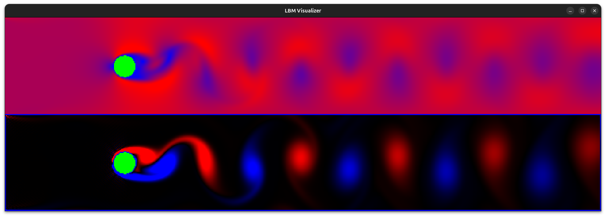
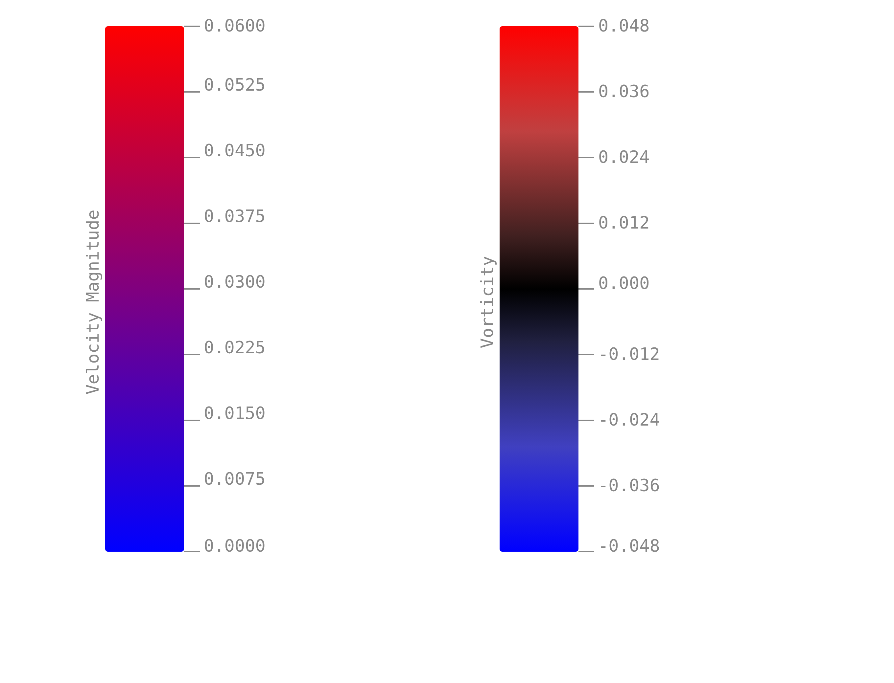
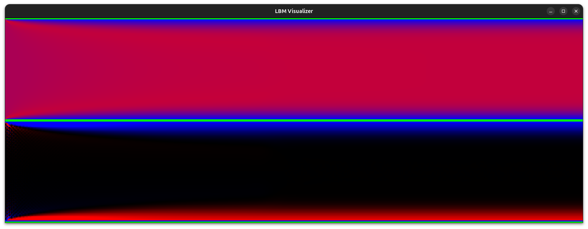

# Lattice Boltzmann Fluid Simulator

A high-performance 2D fluid dynamics simulator built in C++ using the D2Q9 Lattice Boltzmann Method (LBM), achieving a **15x cumulative speedup** over the scalar baseline through a sequence of profiler-driven optimizations: SoA memory layout, manual AVX2 SIMD vectorization, and multi-core parallelization.


*Von Kármán vortex street behind a cylinder at Re=80. Red = positive curl, blue = negative curl, black = zero vorticity. Upper graph velocity, lower vorticity.*


*The color-map used for the images generated above and below*



*Poiseuille flow at Re=80. Upper graph velocity, lower vorticity.*

---

## Physics

The simulator implements the **D2Q9 Lattice Boltzmann Method** — a mesoscopic approach to computational fluid dynamics that models fluid as populations of particles streaming and colliding on a discrete lattice. At each timestep:

1. **Macroscopic quantities** — density ρ and velocity **u** are recovered from the particle distribution functions fᵢ via moment summation
2. **Equilibrium distribution** — the BGK collision operator relaxes fᵢ toward the Maxwell-Boltzmann equilibrium $f^{eq}$ at rate $ω = \frac{1}{τ}$
3. **Collision** — post-collision distributions are computed in-place: f* = f - ω(f - $f^{eq}$)
4. **Streaming** — post-collision populations propagate to neighboring cells along their discrete velocity directions

**Boundary conditions:**
- **Inlet (left):** Zou-He velocity prescription enforcing uniform horizontal inflow U=0.04
- **Outlet (right):** zero-gradient extrapolation allowing vortices to exit freely
- **Cylinder walls:** halfway bounce-back, which enforces the no-slip condition by reflecting populations back in the reverse direction — zero velocity emerges naturally at the solid surface without explicitly setting it
- **Top/bottom:** periodic boundaries matching the reference implementation

**Simulation parameters:**

| Parameter | Value |
|---|---|
| Domain | 300 × 50 (base), 600 × 100 (high-res) |
| Discrete velocities | D2Q9 (9 directions) |
| Inflow velocity U | 0.04 |
| Reynolds number Re | 80 |
| Relaxation rate ω | ≈ 1.967 (τ ≈ 0.508) |
| Cylinder radius | HEIGHT/9 ≈ 5.56 |
| Cylinder position | (WIDTH/5, HEIGHT/2) |

At Re=80, the flow past a cylinder produces a **von Kármán vortex street** — a periodic pattern of alternating counter-rotating vortices shedding from the cylinder wake, visible in both the velocity magnitude and vorticity fields.

---

## Performance

All benchmarks run on 100,000 timesteps, 300×50 domain. Profiling via Linux `perf` with Intel Top-Down Microarchitecture Analysis (TMA).

### Optimization timeline

| Stage | Time (ms) | Speedup vs prev | Cumulative | Primary TMA signal |
|---|---|---|---|---|
| Scalar baseline (double, AoS) | 76,930 | — | 1.0x | bad_speculation 56.2% |
| SoA layout + float precision | 33,944 | 2.27x | 2.27x | bad_speculation → 13.3% |
| Compiler auto-vectorization (`-march=native`) | 29,954 | 1.13x | 2.57x | bad_speculation 35.8% |
| Manual AVX2 SIMD | 14,338 | 2.09x | 5.36x | backend_bound 45.4% |
| Multithreading (6 cores) | 5,097 | 2.81x | **15.1x** | — |

### Stage-by-stage analysis

**SoA layout + float precision (2.27x)**

The original AoS layout stored all 9 pdf values for each cell together in memory. Streaming accesses pdf values by direction across many cells — a strided pattern that caused constant memory-ordering machine clears as the CPU speculated incorrectly on aliasing. Converting to SoA (`pdf[2][HEIGHT][LATTICE_COUNT][WIDTH]`) made same-direction accesses contiguous, collapsing `tma_bad_speculation` from 56.2% to 13.3%. Float precision halved the memory bandwidth requirement.

**Compiler auto-vectorization (1.13x)**

Adding `-march=native -fopt-info-vec` revealed the compiler vectorized only a handful of basic blocks — the hot loops (macroscopic reduction, equilibrium, streaming) all reported `"control flow in loop"` or `"complicated access pattern"`. The 1.13x gain came from vectorizing short scalar initialization sequences. This motivated manual intrinsics. 

The message from this step was that a restructuring both in the dimensions of the arrays (moving the column dimension to be the last) and in the way how the algorithm is executed was needed.

**Manual AVX2 SIMD (2.09x)**

Hand-written AVX2 intrinsics targeting three phases:

- **Macroscopic reduction** — 8-wide horizontal sum across 9 directions using `_mm256_fmadd_ps` for density and velocity accumulation, single `_mm256_rcp_ps` division
- **Equilibrium computation** — fully vectorized BGK f^eq formula with FMA chains for the linear/quadratic/last terms
- **Collision + streaming** — restructured from push (scatter writes) to **pull (gather reads)**

The push→pull restructure was the key algorithmic insight: in push streaming, each cell writes its post-collision pdf to a neighbor — a scatter write that AVX2 cannot express (no scatter instruction). In pull streaming, each cell reads the pdf that *would have streamed to it* from its upstream neighbor — a gather read, which AVX2 supports via `_mm256_i32gather_ps`. This converted an inherently scalar scatter pattern into a vectorizable gather pattern, enabling SIMD on the streaming pass.

`tma_bad_speculation` dropped from 35.8% → 4.3% (branches replaced by branchless `_mm256_blendv_ps` for obstacle handling). Instructions dropped from 402B → 108B (3.7x reduction).

**Multithreading (2.81x, 6 cores)**

Static row-strip domain decomposition with `std::barrier` synchronization between collision and streaming phases. Each thread owns ~8 rows. Empirically, 6 threads outperformed 8 — with only 50 rows total, barrier synchronization overhead (all threads writing to the same atomic counter cache line) exceeded the parallelism gain beyond 6 threads. This is consistent with Amdahl's law: the barrier cost is fixed per iteration while work per thread decreases linearly with thread count. 

Later when running simulations with larger row sizes, 8 threads significantly outperformed the 6 threads that were optimal with 50 rows.

**Negative results (measured and reverted):**

- Branchless obstacle check via array lookup: +20% slower — the branch was already well-predicted (0.10% miss rate); array indirection increased memory pressure and aliasing speculation
- Flat 1D loop with `i%WIDTH`, `i/WIDTH` inside z-loop: +21% slower — division/modulo computed 9x redundantly per cell, confirmed by `tma_bad_speculation` jumping to 53.1%
- 8 threads vs 6 threads: slower due to barrier overhead on small domain
---

## Implementation

### Architecture

```
src/
  lbm.cpp              — core simulation: initialize(), update()
  lbm_parallel.cpp     — thread pool: init_threads(), run_iteration(), stop_threads()
  render_simulation.cpp — OpenGL visualization
  benchmark_simulation.cpp — headless benchmark harness
  cell.cpp —               initialisaions of the arrays used in the simulation
  main.cpp —               entry point of the program
include/
  cell.hpp             — SoA static arrays (pdf, pdf_eq, density, velocity_x, velocity_y, blockade)
  lbm_c.hpp            — physical constants, discrete velocities, weights
  math_util.hpp        — Vect<T> struct with dot product, euclidean distance
  benchmark_simulation.hpp        — API wrapper for benchmark_simulation.cpp
  render_simulation.hpp        — API wrapper for render_simulation.cpp
  lbm_parallel.hpp        — API wrapper for lbm_parallel.cpp
  lbm.hpp        —         API wrapper for lbm.cpp
```

### Memory layout

All cell data stored as Structure of Arrays for contiguous same-type access:

```cpp
template <typename T>
using Lattice =
    std::array<std::array<T, LBM_CONSTANTS::WIDTH>, LBM_CONSTANTS::HEIGHT>;

template <typename T>
using PdfLattice = std::array<std::array<std::array<T, LBM_CONSTANTS::WIDTH>,
                                         LBM_CONSTANTS::LATTICE_COUNT>,
                              LBM_CONSTANTS::HEIGHT>;


alignas (64) PdfLattice<float> pdf[2];   // 2 × 50 × 9 × 304 floats
alignas (64) PdfLattice<float> pdf_eq[2];

alignas (64) Lattice<float> density;
alignas (64) Lattice<float> velocity_x;
alignas (64) Lattice<float> velocity_y;
alignas (64) Lattice<int32_t>   blockade;                // 32-bit for SIMD gather alignment
```

Double buffering (`k` and `k^1`) eliminates read-write hazards between streaming steps.

### Key SIMD patterns

**Macroscopic reduction (8 cells × 9 directions):**
```cpp
__m256 density_arr = zero;
__m256 velocity_x  = zero;
__m256 velocity_y  = zero;
for (std::size_t z = 0; z < LATTICE_COUNT; z++) {
    __m256 res    = _mm256_loadu_ps(&Cell::pdf[k][i][z][j]);
    density_arr   = _mm256_add_ps(density_arr, res);
    velocity_x    = _mm256_fmadd_ps(_mm256_set1_ps(DISC_VELOCITY[z].x), res, velocity_x);
    velocity_y    = _mm256_fmadd_ps(_mm256_set1_ps(DISC_VELOCITY[z].y), res, velocity_y);
}
__m256 inv_rho = _mm256_rcp_ps(density_arr);
velocity_x = _mm256_mul_ps(velocity_x, inv_rho);
velocity_y = _mm256_mul_ps(velocity_y, inv_rho);
```

**Pull streaming with gather + branchless obstacle blending:**
```cpp
// compute source cell indices for 8 lanes simultaneously
__m256i source_x = _mm256_sub_epi32(pos_x, disc_velocity_x);  // j - e_x
__m256i source_y = _mm256_sub_epi32(pos_y, disc_velocity_y);  // i - e_y
// ... periodic wrap via conditional subtract ...

// gather pdf from source cells
__m256 pulled_pdf = _mm256_i32gather_ps(&Cell::pdf[0][0][0][0], source_idx, 4);

// gather blockade flags, build blend mask
__m256i blockade_vals = _mm256_i32gather_epi32(&Cell::blockade[0][0], new_ind, 4);
__m256  blockade_mask = /* 0xFFFFFFFF where source is obstacle */;

// branchless: bounce-back where obstacle, pull-stream otherwise
__m256 result = _mm256_blendv_ps(pulled_pdf, bounce_back, blockade_mask);
```

### Thread synchronization

Persistent worker threads with `std::barrier<>` — threads spawn once at initialization and run until explicitly stopped, avoiding spawn/join overhead per timestep:

```
main thread          worker threads
     │                     │
run_iteration():           │
  barrier #1 ─────────► collision pass
  barrier #2 ◄───────── collision done
  barrier #3 ─────────► streaming pass
     │        ◄───────── streaming done
     │                     │
```

---

## Visualization

Real-time OpenGL 3.3 renderer uploading an RGB texture each frame via `glTexSubImage2D`.

**Velocity magnitude** — red = high speed, blue = low speed. Shows the recirculation zone and wake structure.

**Vorticity (curl)** — computed via central differences: ω = ∂u_x/∂y − ∂u_y/∂x. Red = positive curl (counterclockwise), blue = negative curl (clockwise), black = irrotational flow. Best visualization for the von Kármán street.

---

## Validation

Poiseuille flow (pressure-driven channel flow) produces a parabolic velocity profile with analytical solution u(y) = (1/2ν)(dp/dx)y(H−y). The simulation matches this profile confirming correct no-slip wall implementation and macroscopic recovery.

---

## Build

```bash
mkdir build && cd build
cmake .. -DCMAKE_BUILD_TYPE=Release
cmake --build . -j$(nproc)

# benchmark (headless)
./LBMSim benchmark

# visualization
./LBMSim render
```

**Dependencies:** GLFW3, OpenGL 3.3, GLAD (vendored), C++20 compiler with AVX2 support.

**Compiler flags:** `-O3 -march=native -std=c++20`

---

## References

- Q. Zou and X. He, "On pressure and velocity boundary conditions for the lattice Boltzmann BGK model," Physics of Fluids, vol. 9, no. 6, pp. 1591–1598, Jun. 1997, doi: 10.1063/1.869307.Q. Zou and X. He, "On pressure and velocity boundary conditions for the lattice Boltzmann BGK model," Physics of Fluids, vol. 9, no. 6, pp. 1591–1598, Jun. 1997.
- S. C. Wetstein, "Implementing the Lattice-Boltzmann Method: A Research on Boundary Condition Techniques," B.Sc. thesis, Dept. Applied Physics, Delft University of Technology, Delft, The Netherlands, 2014. https://filelist.tudelft.nl/TNW/Afdelingen/Radiation%20Science%20and%20Technology/Research%20Groups/RPNM/Publications/BSc_Suzanne_Wetstein.pdf
- Intel Intrinsics Guide — [https://www.intel.com/content/www/us/en/docs/intrinsics-guide](https://www.intel.com/content/www/us/en/docs/intrinsics-guide)
